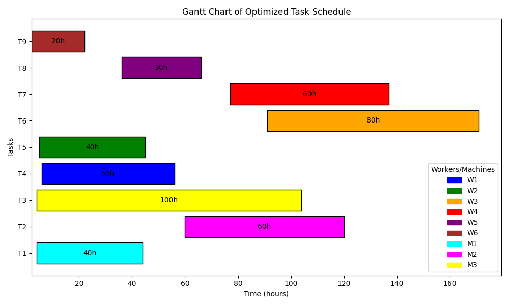

# BuildSched - Construction Task Scheduling Optimization

  

## Overview

**BuildSched** is a project that tackles the **scheduling optimization problem** using a **genetic algorithm**. The goal is to automate the creation of optimized task schedules for a large-scale construction project by assigning tasks to workers and machines in a way that:

- **Minimizes idle time** for workers and machines.
- **Respects task dependencies**, ensuring that tasks are completed in the correct order.
- **Maximizes efficiency** by adhering to the available working hours for workers and machines.

### Project Write-up: Scheduling Optimization Using a Genetic Algorithm

Efficiently scheduling tasks on a construction site can be challenging. For large projects like building an office block, construction managers must assign tasks to workers and machines in a way that minimizes downtime and maximizes productivity. This becomes increasingly complex when you consider constraints such as task dependencies (some tasks must be completed before others can start), limited availability of specialized workers and machines, and fixed working hours for resources.

The objective of this project is to generate an optimized task schedule that minimizes downtime and maximizes efficiency, ensuring that all tasks are completed in the correct order.

This project uses a **genetic algorithm (GA)** to generate and evolve a population of possible schedules. Each schedule is represented as a chromosome, with tasks assigned to workers and machines based on various constraints. The GA operations include:

- **Selection**: Choosing schedules with the best fitness scores to form the next generation.
- **Crossover**: Combining parts of two parent schedules to create offspring with potentially better task allocations.
- **Mutation**: Introducing small random changes to schedules to maintain diversity and avoid premature convergence.

The final output is an optimized schedule that assigns tasks to workers and machines over a timeline. The solution also provides a **Gantt chart** visualization to illustrate how tasks are distributed, which helps construction managers easily understand and implement the schedule.

---

## Task and Worker/Machine Information

### 1. Tasks
Each task has a unique ID, duration (in hours), dependencies (other tasks that need to be completed first), and the required resource (either a worker or machine).

| Task ID | Description           | Duration (Hours) | Dependencies | Required Resource |
|---------|-----------------------|------------------|--------------|-------------------|
| T1      | Site Preparation       | 40               | None         | Excavator         |
| T2      | Foundation Laying      | 60               | T1           | Concrete Mixer    |
| T3      | Steel Frame Erection   | 100              | T2           | Crane             |
| T4      | Electrical Wiring      | 50               | T3           | Electrician       |
| T5      | Plumbing Installation  | 40               | T3           | Plumber           |
| T6      | Interior Walls         | 80               | T4, T5       | Carpenter         |
| T7      | Roofing Installation   | 60               | T6           | Roofer            |
| T8      | Window Installation    | 30               | T6           | Glazier           |
| T9      | Final Inspections      | 20               | T7, T8       | Inspector         |

### 2. Workers/Machines
Each worker/machine has a unique ID, skillset, and working hours available per day.

| Worker/Machine ID | Type    | Skillset/Capability | Working Hours (per day) |
|-------------------|---------|---------------------|-------------------------|
| W1                | Worker  | Electrician         | 8                       |
| W2                | Worker  | Plumber             | 8                       |
| W3                | Worker  | Carpenter           | 8                       |
| W4                | Worker  | Roofer              | 8                       |
| W5                | Worker  | Glazier             | 8                       |
| M1                | Machine | Excavator           | 10                      |
| M2                | Machine | Concrete Mixer      | 10                      |
| M3                | Machine | Crane               | 10                      |
| W6                | Worker  | Inspector           | 6                       |

### 3. Constraints
We need to consider the following constraints in our genetic algorithm:

1. **Working Hours**: Each worker/machine can only work within their allotted working hours per day.
2. **Task Dependencies**: Certain tasks need to be completed before others can start. For example, the foundation must be laid before the steel frame can be erected.
3. **Machine/Worker Availability**: Some tasks require specific machines or skilled workers, which can’t be assigned to other tasks simultaneously.
4. **Task Duration**: Each task has a specific duration, which needs to be completed within the available working hours of the assigned worker or machine.

---

## Gantt Chart Visualization

Below is the visual representation of the optimized task schedule.



---

## Chart Description: Optimized Task Scheduling Gantt Chart

The Gantt chart above represents an **optimized task schedule** for a construction project. This schedule was generated using a **genetic algorithm**, which efficiently assigns tasks to workers and machines while minimizing idle time and respecting task dependencies. Here’s a detailed breakdown:

### Tasks (Y-Axis)

Each horizontal bar in the chart corresponds to a **specific task** involved in the construction process, identified by labels on the left side of the chart (e.g., `T1`, `T2`, ..., `T9`). These tasks represent key stages such as Site Preparation, Foundation Laying, and Final Inspections.

### Timeline (X-Axis)

The **x-axis** represents time in **hours**. The position of each bar on this axis indicates when a particular task starts and ends. For instance, **T1** (Site Preparation) starts at hour 0 and runs until hour 40.

### Task Duration

Inside each bar, you’ll see a number indicating the **duration of the task** in hours. The longer the bar, the more time the task will take to complete.

### Color Coding: Workers and Machines

Each bar is color-coded to represent which **worker** or **machine** is assigned to the corresponding task. The color legend on the right side of the chart maps the colors to the workers/machines involved, such as **W1** (Electrician) and **M1** (Excavator).

### Task Dependencies and Scheduling

The genetic algorithm takes into account **task dependencies** (some tasks cannot start until others are completed), ensuring that the project progresses in the correct order. For example, **T9** (Final Inspections) must wait for the completion of **T7** (Roofing Installation) and **T8** (Window Installation).

### Optimized Scheduling

The genetic algorithm has optimized the task assignments to ensure:

- **Minimal idle time** for workers and machines.
- **Maximized efficiency** in task completion.
- **Respect for task dependencies**, ensuring that tasks proceed in the correct order.

---

## How to Run This Project

### Requirements

- Python 3.x
- `matplotlib` (for visualization)

### Installation

1. **Install Python**: Ensure you have Python 3.x installed on your system. You can download Python [here](https://www.python.org/downloads/).

2. **Clone the Repository**: Clone this repository to your local machine.

```sh
git clone https://github.com/yourusername/BuildSched.git
cd BuildSched
```

3. **Install Dependencies**: Install the required dependencies using `pip`:

```sh
pip install -r requirements.txt
```

### Running the Project

Once you have all dependencies installed, you can run the project by executing `main.py`:

```sh
python main.py
```

This will run the genetic algorithm, generate the optimized schedule, and display the Gantt chart of the task schedule.

---

## License

This project is licensed under the MIT License. See the [LICENSE](LICENSE) file for details.
